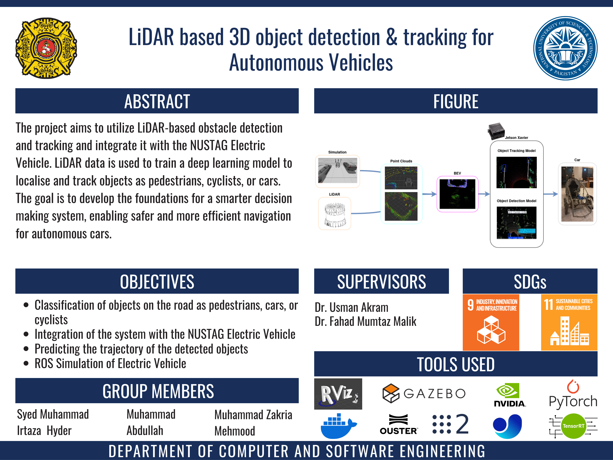
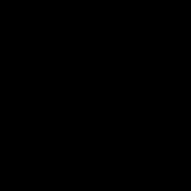
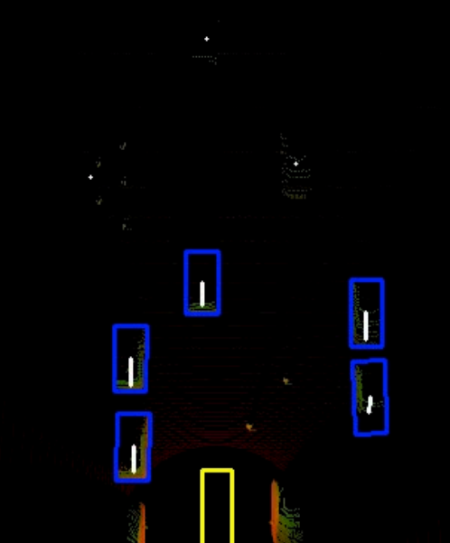

# LiDAR based Object Detection and Tracking for NUSTAG Electric Vehicle

## Summary
### Abstract
The Final Year Project aims to use the Ouster OS1 Gen1 LiDAR for Object Detection and Tracking. The end goal is to correctly classify whether the object is a Car, Cyclist or Pedestrian, and further track their future trajectory to allow the EV to make smart decisions.

### Deliverables
- [x] Object Detection and Traking Model
- [x] Simulations for Testing and Validation of Model
- [x] Integration with the NUSTAG Autonomous Vehicle

### Methodology
By converting the 3D point Cloud Data into [BEV image](https://arxiv.org/abs/1803.06199), we trained the various deep learning models to detect and classify the objects as Car, Cyclist, or Pedestrains. *YOLO 11s* was our best performing model. Furthermore, the trajectory of the detected objects (upto 2 seconds in the future) were found using *ByteTrack*.

The model were then converted to TRT models (.engine) to run with lower latency on Jetson Xavier.

### Output

## Background
The NUST Automobile Group designs, develops and maintains student built cars which are taken to different competitions world wide. Details about the mechanical and electrical design can be found in the [Teknofest Report](Teknofest_2022-Robo_Taxi_NUSTAG.pdf).

Our project was for the NUSTAG Autonomous Vehicle. The vehicle initially utilized mono and stereo cameras for its perception stack. Additionally it used CAN BUS communication (but that was not functional when we started the project).

We have enhanced the perception system using the LiDAR, providing on edge detection at 60fps. Furthermore the car's control system has been shifted to utilizing UART communication due to its ease of implementation.
## Hardware
1. Ouster Gen 1 OS1 Lidar
2. Nvidia Jetson Xavier AGX
3. ESP-32
4. [NUSTAG Autonomous Vehicle](https://github.com/le9endary/Lane-Detection-and-YOLO-TRT-Implementation-NUSTAG-EV)

## Repository Structure
Use `git clone --recurse-submodules https://github.com/SyedMIrtazaHyder/LiDAR_based_Object_Detection_and_Tracking.git` when cloning the repo.

The [models](models) folder contains the mentioned deep learning models trained. Currently only the PyTorch models are available as TensorModels tend to differ based on hardware used.

The [ROS2](ROS2) folder contains the Dockerfile, compose.yaml and .tmux file for setting up the Docker environment. It also contains the source folder that has all the relevant ROS2 packages to for visualization and simulation purposes.

The [scripts](scripts) folder cotains the tracker algorithm as well as the real-time detection and video-based detection scripts. Note that the video-based detection script takes the BEV image as input. A PCAP -> BEV convertor script is also provided.

## Results
| Model | TRT inference | mAP % at 50 IoU | mAP at 50-95 IoU |
| ----------- | ----------- | ----------- | ----------- |
Complex YOLOv3 Tiny | 51 | 56.87 | 48.6 |
Complex YOLOv4 Tiny | 45 | 64.11 | 59.1 |
YOLOv11 Small OBB | 10 | 93.0 | 71.2 |
YOLOv12 Nano OBB | 15| 87.5 | 66.7 |
YOLOv12 Small OBB | 32 | 86.8 | 68.7 |
RT-DETR | 50 | 65.4 | 58.9 |

## Collaborators
1. [Muhammad Abdullah](https://github.com/mabdullah-imran): Development of Object Detection and Tracking Algorithms & Implementation of models on Hardware
2. [Muhammad Zakria Mehmood](https://github.com/ZakriaComputerEngineer): Development and Training of Object Detection Models
3. [Syed Muhammad Irtaza Hyder](https://github.com/SyedMIrtazaHyder): Development of Simulations and Visualizations & Integration of LiDAR with Vehicle

## Acknowledgment
Firstly we would like to thank our professors [Usman Akram](https://scholar.google.com/citations?hl=en&user=2BntV9IAAAAJ) and [Fahad Mumtaz Malik](https://scholar.google.com/citations?hl=en&user=i9ycd5sAAAAJ) for their continous support and providing us the resources for making the project possible.

We want to further extend our thanks to [Muneeb Ahmad](https://github.com/muneebahmed26301) for developing the LiDAR mount and helping us to attach the LiDAR to the car.

## Resources
https://github.com/maudzung/Complex-YOLOv4-Pytorch

https://github.com/ouster-lidar/ouster-ros

https://github.com/ouster-lidar/ouster-sdk

https://docs.ros.org/en/humble/index.html

https://github.com/le9endary/Lane-Detection-and-YOLO-TRT-Implementation-NUSTAG-EV

## License
This project is licensed under the MIT License. See the [LICENSE](LICENSE) file for details.
