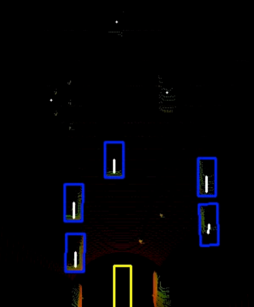

# Docker setup

To set up the ros2 environment using docker run:
``` bash
cd ROS2
docker build .
docker compose up

# Running container to see the ros files and stuff
xhost +
docker exec -it <container name> bash
```

The tmux_setup.bash script sets up the environment and runs teh relevant containers itself if tmux is installed on the system.

To review the ROS2 commands the functionalities visit the submodule folder
## Overview


### Sensor RQT


### Simulation RQT


## Simulation

